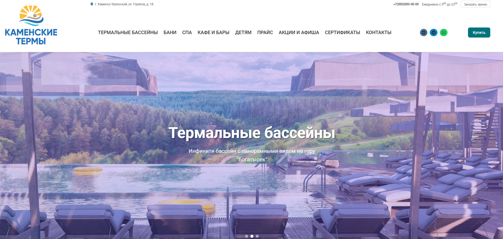

# Каменские термы

Сайт термального комплекса в Каменске-Уральском: бассейны, бани, SPA, кафе, акции и контакты.

## О проекте

Одностраничный по смыслу сайт на Django с разделами:

- **Главная** — слайдер (видео/фото), акции, блок «Наши услуги», галерея
- **Термальные бассейны** — типы бассейнов и услуги
- **Бани** — бани и сауны
- **SPA** — SPA-услуги
- **Кафе и бары**
- **Детям**
- **Прайс** — таблица цен
- **Акции и афиша**
- **Сертификаты**
- **Контакты**

Есть шапка с навигацией, соцсетями и кнопкой «Купить», мобильное меню-бургер, модальное окно бронирования.

## Технологии

- **Backend:** Django 4.2, Python 3
- **Frontend:** HTML, CSS (в т.ч. страничные стили), немного JS (слайдер, меню, модалки)
- **Статика:** WhiteNoise
- **Деплой:** можно запускать через gunicorn + whitenoise (без nginx для простого варианта)

## Установка и запуск

```bash
# Клонировать репозиторий
git clone https://github.com/YOUR_USERNAME/kamensk-termy.git
cd kamensk-termy

# Виртуальное окружение
python -m venv venv
# Windows:
venv\Scripts\activate
# Linux/macOS:
# source venv/bin/activate

# Зависимости
pip install -r requirements.txt

# Миграции
python manage.py migrate

# (опционально) Заполнить тестовые данные
python manage.py runscript populate_data

# Запуск
python manage.py runserver
```

Сайт будет доступен по адресу: http://127.0.0.1:8000/

## Скриншоты

Ниже можно добавить скриншоты интерфейса. Положите изображения в папку `docs/screenshots/` и вставьте сюда ссылки.

| Описание        | Скриншот |
|-----------------|----------|
| Главная страница | *(добавьте `docs/screenshots/main.png`)* |
| Акции           | *(добавьте `docs/screenshots/actions.png`)* |
| Прайс           | *(добавьте `docs/screenshots/price.png`)* |

Пример вставки после добавления файлов:

```markdown


```

## Лицензия

Проект для личного/учебного использования.
